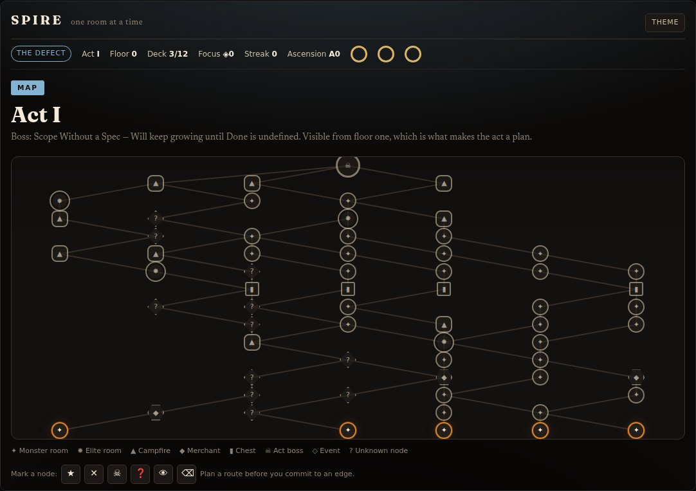
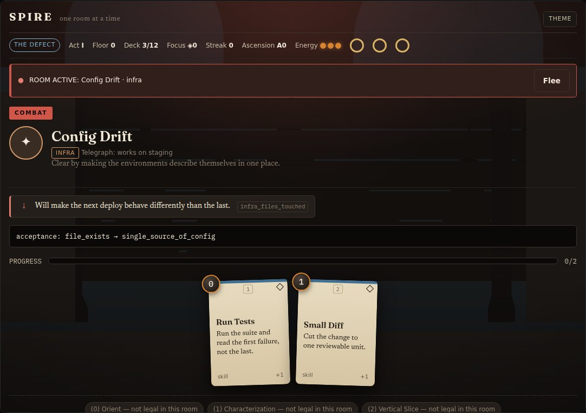
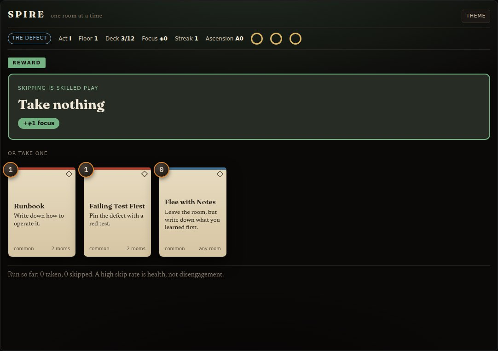
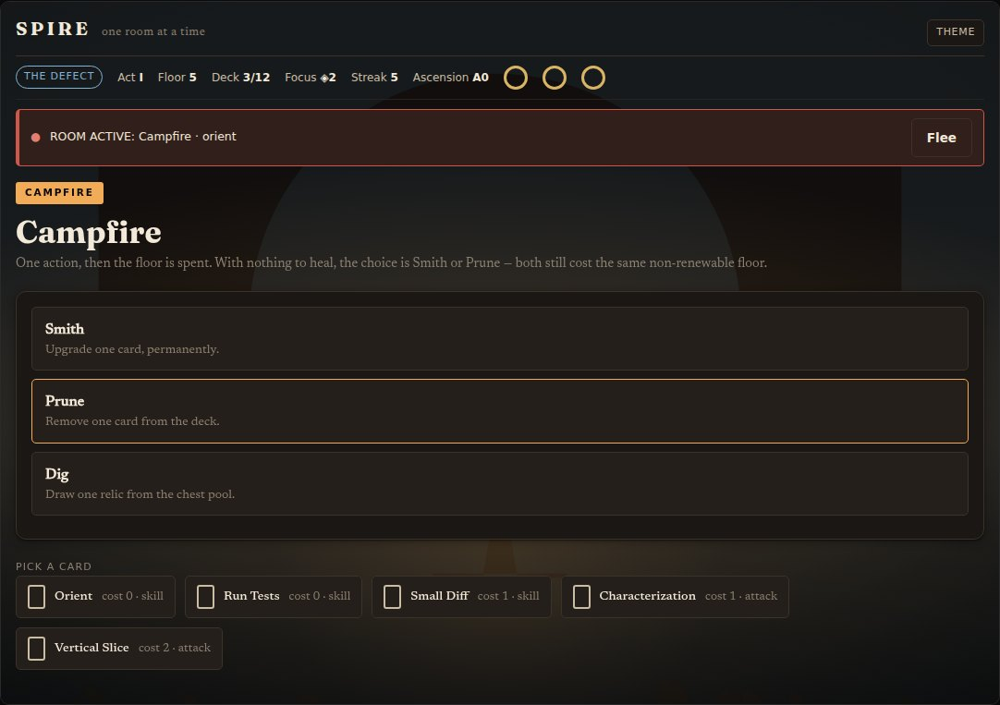
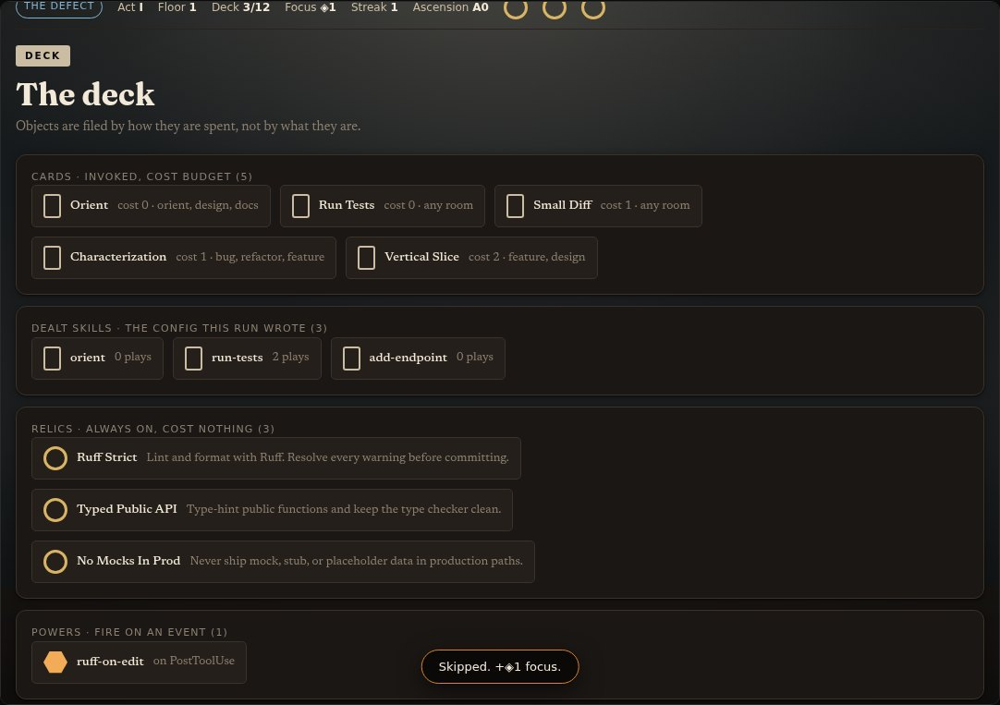

# spire

**Your project is the run. Your Claude config is the deck.** A Claude Code plugin
that scans any repository, deals it a starter deck of Claude config, and grows
that deck as you clear rooms.

> Your project is the run. Your Claude config is the deck. spire is the
> game engine.

| Slay the Spire | spire |
|---|---|
| Card | Agent Skill (`.claude/skills/…/SKILL.md`) |
| Relic | `CLAUDE.md` rule |
| Power | Hook |
| Character class | Repo archetype (detected at init) |
| Save file | `.spire/deck.json` in the target repo |
| Ascension | A0–A20 strictness ladder for the same hooks |

---

## The client

Spire ships a game client as an **MCP App** — an interactive UI the host renders
inline in the conversation. It runs on the real save file: the map is generated
from your run's seed, the hand is your actual dealt config, and clearing a room
ticks the floor in `.spire/deck.json`.

<p align="center">
  
</p>

| Room | Reward |
| --- | --- |
|  |  |

| Campfire | Deck |
| --- | --- |
|  |  |

<sub>Light theme, narrow-panel, greyscale and reduced-motion captures of every
screen live in <a href="docs/screenshots/">docs/screenshots/</a>. They are
generated by <code>node tools/shoot.mjs</code>, which drives the shipping client
through a whole run and fails if a screen does not render.</sub>

**Where it renders.** MCP Apps are supported by Claude (web and desktop), VS Code
GitHub Copilot, Cursor, ChatGPT and others. **Claude Code is not on that list** —
neither the terminal nor the VS Code extension, which is the same client in a
panel. So every tool also returns a drawn text rendering of the same state, and
the server offers the full verb set to any host that cannot render the app, so
the game is genuinely playable there rather than merely visible:

```
┌──────────────────────────────────────────────────────────────────┐
│ SPIRE · Act I · Floor 3 · The Defect                             │
│ Deck 6/12   Focus ◈2   Streak 4   Ascension A10                  │
├──────────────────────────────────────────────────────────────────┤
│ ✸ Flaky Suite  ·  Elite room                                     │
│   Telegraph: CI roulette                                         │
├──────────────────────────────────────────────────────────────────┤
│ INTENT                                                           │
│   ⚔ 4  Will fail CI randomly if ignored.      [tests_failing]    │
│   ↑    Gets harder to reproduce the longer it runs.              │
├──────────────────────────────────────────────────────────────────┤
│ PROGRESS  ████████░░░░░░░░░░░░  2/4                              │
│ ENERGY    ●●○   turn 2                                           │
└──────────────────────────────────────────────────────────────────┘
```

---

## What it does

Run `/spire` in any repo and it will:

1. **Scan** the repo to detect its *class* (archetype) — deterministically, from
   the files present.
2. **Deal a starter deck** into the repo: `CLAUDE.md` rules (**relics**) and
   `.claude/skills/` procedures (**cards**) suited to that class.
3. **Write a save file** at `.spire/deck.json` that tracks the run.

From there, the deck **grows on its own**: a `Stop` hook watches for real work
(a new commit, meaningful activity) and — only when a pattern has genuinely
repeated — a cheap-model curator offers up to three new cards. You review the
offer at `/spire:campfire`, where you can also prune cards nobody's
touched. And `/spire:ascend` lets you dial up how strictly the repo's
own hooks enforce lint, tests, and coverage as the project matures.

The plugin is the game engine and holds **zero project knowledge**; everything it
knows about *your* project gets written into *your* repo, where it belongs.
**Run knowledge** lives under `.spire/`; **agent primitives** (skills the agent
must load) stay in `.claude/`.

## Install

```
/plugin marketplace add hhalperin/spire
/plugin install spire@spire
```

Then, in any project:

```
/spire            # scan, detect class, deal the starter deck
/spire:map        # show run state + deck-health stats
/spire:campfire   # resolve a pending reward, or review the deck for pruning
/spire:shop       # draw optional cards from a community card pack
/spire:ascend     # raise or lower the ascension tier (A0-A20)
```

<sub>Developing locally? `claude --plugin-dir ./` loads it without a marketplace,
and `claude plugin validate` checks the manifest.</sub>

### The game client (beta)

The five commands above need nothing but Python 3. The client needs its server
built once:

```
cargo build --release --manifest-path server/Cargo.toml
```

The plugin's `.mcp.json` starts it automatically after that. Without it the
commands all still work — only the game surface is missing, and the launcher
says so rather than failing silently.

To look at the client without a host, run `node tools/host/serve.mjs` and open
the URL it prints: a minimal MCP Apps host that speaks the real postMessage
protocol to the real server.

### The reward loop (optional)

Card offers are judged by a small Python script (`scripts/curator.py`) using
the [Claude Agent SDK](https://github.com/anthropics/claude-agent-sdk-python).
It's an **optional soft dependency** — without it, everything else in the
plugin works identically, the reward loop just stays quiet:

```
pip install claude-agent-sdk
```

## What gets dealt

```
your-repo/
├── CLAUDE.md                       # relics: rules & conventions for the class
├── .spire/                         # the run (save + bookkeeping + helpers)
│   ├── deck.json                   # durable save file
│   ├── state.json                  # ephemeral Stop-hook bookkeeping (gitignored)
│   ├── pending-reward.json         # offer awaiting /campfire (gitignored)
│   ├── ascension.json              # ascend's config (tier + lint/test commands)
│   └── bin/
│       ├── record_play.py          # self-contained helpers — keep working with
│       └── ascension_gate.py       #   no engine/plugin installed at all
└── .claude/
    ├── settings.json               # only once you /spire:ascend past A0
    └── skills/                     # cards: skills the agent loads
        └── <card>/SKILL.md
```

Pre-spire saves under `.claude/deck.json` (and related files) are migrated into
`.spire/` automatically the next time an engine script runs.

## Classes

| Class | Detected by | Starter flavor |
|---|---|---|
| **Defect** | `pyproject.toml`, `requirements.txt` | pytest/endpoint cards, ruff & typing relics |
| **Silent** | `package.json`, `tsconfig.json` | component + test cards, strict-TS relics |
| **Ironclad** | `Dockerfile`, `*.tf`, `terraform/` | plan/drift cards, plan-before-apply relics |
| **Watcher** | `*.ipynb`, `models/`, ML deps | experiment-log + eval cards, reproducibility relics |
| **Colorless** | anything else | a minimal, safe deck |

Monorepos (strong signals across two language families) become **dual-class**
runs and share one `deck.json`. Each class also declares a `lint`/`test`
command (used by `/spire:ascend`) — `null` where no command is
universal enough to enforce automatically.

## The reward loop

A `Stop` hook (`scripts/reward_gate.py`) fires after every turn but does
almost nothing most of the time: only a new commit, or enough tool-call
activity, makes it worth asking the curator anything at all. When it does ask,
`scripts/curator.py` judges strictly by house rules — **default to skip**;
offer only for a pattern that's genuinely repeated; past a ~12-card soft cap,
every offer must name a card to trade away. An offer is never sprung on you
mid-task: it's detected at `Stop` and surfaced quietly at your next session
start, or whenever you run `/spire:campfire`.

## The ascension ladder

`/spire:ascend` raises how strictly your *own* dealt hooks enforce
quality, by rewriting your repo's `.claude/settings.json` (merging in just its
own entry — anything else already there stays untouched):

| Tier | Enforcement |
|---|---|
| **A0** | hooks warn only (no blocking) |
| **A5** | block the Stop if lint fails |
| **A10** | A5, plus block if tests fail |
| **A15** | A10, plus block on a coverage regression (best-effort — only when a coverage number can actually be parsed from test output) |
| **A20** | A15, plus every room gets a reward-curator review instead of a sampled subset |

Ascension only ever moves when you ask — never automatically.

## The save file — `.spire/deck.json`

```json
{
  "class": "defect",
  "act": 1, "floor": 0, "ascension": 0,
  "cards": [
    {"name": "add-endpoint", "type": "skill",
     "added_floor": 0, "plays": 0, "last_played": null}
  ],
  "relics": ["ruff-strict"],
  "rewards": {"offered": 0, "taken": 0, "skipped": 0}
}
```

The `taken / skipped` ratio is a deck-health metric. Good players skip most
rewards — a lean deck is a strong deck. `/spire:map` now also runs
`deck.py stats` for a deterministic read: total plays, the most-played card,
which cards are unplayed (prune candidates), and the reward take rate.

---

## Status & roadmap

**Act 1 — the starter deck (shipped).** `/spire` init, deterministic
`scan.py`, 5 classes, `.spire/deck.json`, and `/spire:map`.

**Act 2 — the engine (shipped).** The `Stop`-hook reward loop
(`reward_gate.py` + `curator.py`), per-card play tracking via skill-scoped
hooks, and `/spire:campfire` for accepting/skipping offers and pruning
via the `deck-curator` agent.

**Act 3 — ascension (shipped).** The A0–A20 strictness ladder
(`/spire:ascend`), ascension shown in the session-start status line,
and `deck.py stats` for deck-health numbers.

**The Heart — community (started).** Card packs (`packs/testing-discipline`,
`/spire:shop`, `pack.py list`), room/floor progression on cleared rooms,
starter powers recorded in `deck.json`, and class detection driven by
`classes/detection.json`. More community classes and deck export still planned.

**Spire AI (design).** The longer arc — a project-building roguelike with an MCP
app UI — lives in [`design/spire-ai/`](design/spire-ai/README.md).

## Contributing

The contribution surface is markdown and YAML — new **classes** and **card
packs**, not Python. See [CONTRIBUTING.md](CONTRIBUTING.md).

## License

[MIT](LICENSE).
